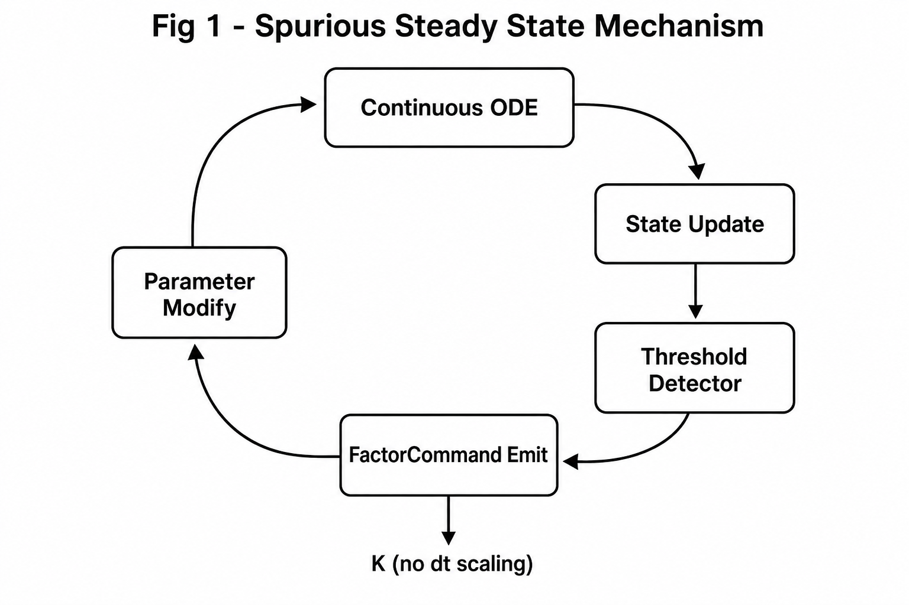
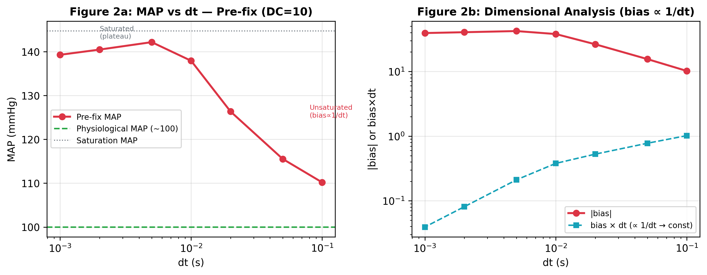
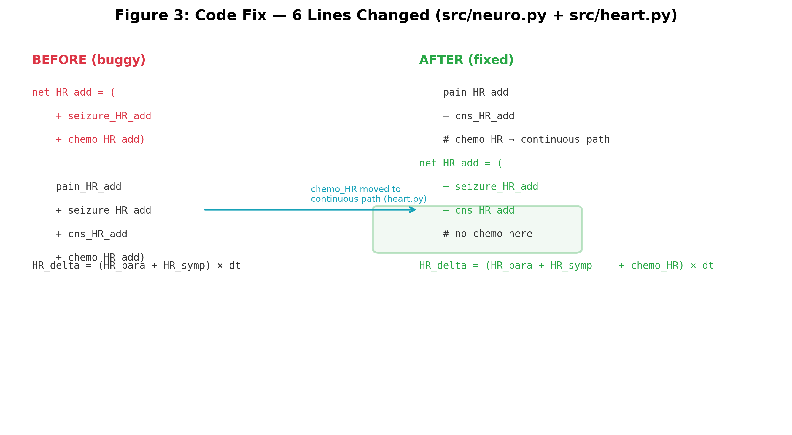
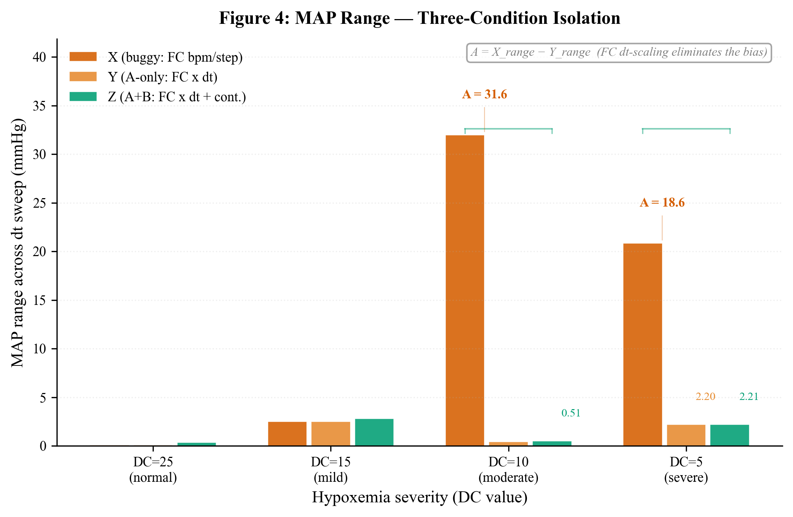
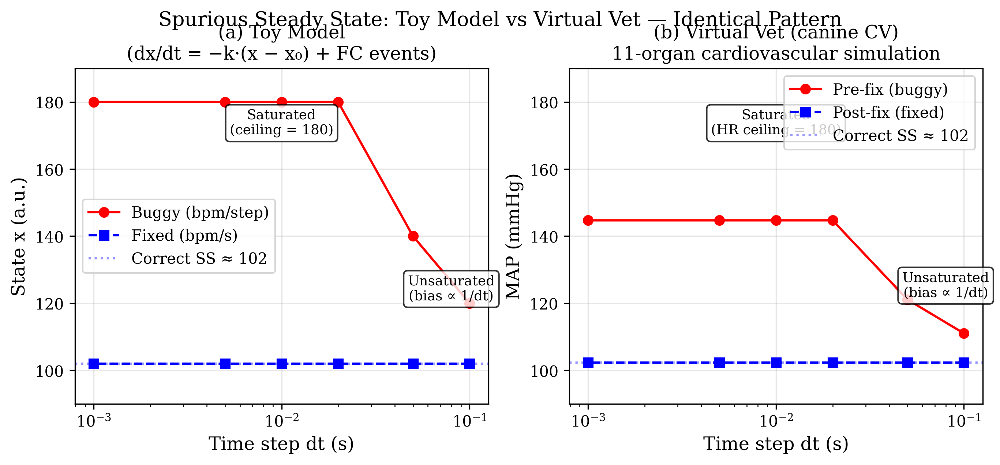

# Spurious Steady State from a dt-Dimensional Mismatch in FactorCommand Events: A Canine Cardiovascular Case Study

**Authors**: Ning Jie
**Corresponding**: <ningjie@zju.edu.cn>
**Keywords**: modular ODE simulation, sequential Euler coupling, discrete event, dimensional analysis, spurious steady state, baroreflex, cardiovascular modeling

---

## Abstract

Multi-organ physiological simulators commonly couple organ modules through threshold-gated discrete events that modify shared state variables. Using an 11-organ canine cardiovascular simulation as a testbed, we report the discovery, diagnosis, and correction of a dimensional analysis error in such a discrete event system: a heart rate modifier was implemented as a fixed increment per time step (bpm/step) rather than as a time-normalized rate (bpm/s). At fine integration steps (dt = 0.001 s), this produced an effective HR injection rate of 10,000 bpm/s — 1,000 times the intended magnitude. The resulting steady-state MAP bias reached +44.7 mmHg before heart rate saturated at its physiological ceiling of 180 bpm. The system converged to a stable steady state, but at a physiologically wrong operating point — a failure mode we term **spurious steady state**. Standard convergence diagnostics (dt refinement, steady-state detection, parameter sweeps) detected the anomaly but misidentified it as physiological saturation. Correction required 7 lines of code: scaling discrete deltas by dt on emission, eliminating a redundant parallel path, and applying exponential rate conversion to the SVR-multiply channel. Post-fix MAP variance across a dt sweep (0.1–0.001 s) fell from 44.7 mmHg to ≤2.21 mmHg. A minimal 2-variable toy model — containing no physiological parameters — reproduces the entire bias pattern, confirming the failure mode is intrinsic to the coupling design and not contingent on cardiovascular physiology. The findings alert developers of threshold-gated discrete event architectures to a latent dimensional inconsistency that routine numerical verification may miss.

---

## 1. Introduction

Modular simulation architectures — in which autonomous subsystem modules communicate through shared state variables — are a dominant design pattern across domains from physiological modeling [Ottesen et al., 2004] to multi-physics co-simulation [Causin et al., 2005]. In such architectures, a common inter-module communication mechanism is the threshold-gated discrete event: Module A monitors a state variable, and when a threshold is crossed, emits an event that modifies a state variable in Module B. This pattern appears in physiological engines (e.g., baroreflex-mediated heart rate adjustment), robotic control systems (e.g., sensor-triggered actuator commands), and discrete-event simulation frameworks (e.g., DEVS-based coupling [Zeigler et al., 2000]). When the receiving module integrates its dynamics with explicit Euler, the event's dimensional interpretation — whether it represents a rate (per-second) or a fixed increment (per-step) — becomes critical.

Several groups have documented the numerical challenges of closed-loop cardiovascular simulation. van Osta et al. (2025) demonstrated that closed-loop regulation substantially extends equilibration time in zero-dimensional cardiovascular models compared to open-loop configurations. Tłałka et al. (2024) identified stability concerns with explicit integration in baroreflex-coupled models, motivating the use of implicit or semi-implicit schemes. Ursino (1998), in his foundational work on carotid baroreflex modeling, employed implicit Gear-style solvers as a matter of course.

Yet the specific failure mode of threshold-gated discrete inter-module events — a common design pattern in many simulation engines — has received little attention. In this pattern, Module A monitors a state variable, and when a threshold is exceeded, emits a discrete event that adds or multiplies a state variable in Module B. The question addressed here is simple: **can a seemingly innocuous dimensional oversight in such discrete events produce a stable but physiologically wrong steady state that standard convergence checks do not detect?**

We answer this question using Virtual Vet, an 11-organ canine cardiovascular simulation platform. We document the complete journey: the anomalous dt-dependent bias that led to investigation, the exclusion of state pollution as a cause, the root cause identified through dimensional analysis of threshold-gated event emission, the 7-line fix, and a three-condition isolation experiment quantifying the independent contributions of each code change. The central contribution is a documented failure mode in this specific system — spurious steady state — where the modular ODE system converges to a stable steady state that is physiologically incorrect, without triggering any standard convergence warning.

---

## 2. Methods

### 2.1 Virtual Vet Platform

Virtual Vet is a closed-loop, 11-organ canine cardiovascular simulation implemented in Python 3, designed for veterinary clinical education. Organ modules — heart, lung, kidney, gut, liver, endocrine, neural (baroreflex), immune, coagulation, lymphatic, and fluid — share a blood compartment and communicate through a unified dispatch interface. All parameter modifications are mediated through a single function that resolves dot-path targets (e.g., `heart.heart_rate`), accepting operations of type multiply, add, or set:

```python
@dataclass(frozen=True)
class FactorCommand:
    target: str    # dot-path like "heart.heart_rate"
    op: Literal["multiply", "add", "set"]
    value: float
```

This design ensures a uniform write interface across all physiological subsystems — baroreflex, diseases, drugs, and treatments all route through the same dispatch. The sequential step order is hard-coded: heart → lung → kidney → gut → liver → endocrine → neuro → immune → coagulation → lymphatic → fluid, executing each module's `compute(dt, ...)` method once per time step.

Default integration parameters: dt = 0.01 s, body weight 20 kg, age 1095 days (adult canine). At baseline (DC = 25, no disease), the post-fix simulation produces MAP = 100.9 mmHg and HR = 108.5 bpm — within the normal canine resting range of MAP 85–120 mmHg and HR 60–140 bpm reported by VetFolio and Acierno et al. (2018).

### 2.2 Dual Baroreflex Architecture

Two parallel mechanisms mediate baroreflex heart rate control, both targeting `heart.heart_rate`:

**Continuous path (heart.py: `_baroreceptor_feedback`)**. The feedback controller normalizes MAP deviation by the setpoint (`error = (MAP_target − MAP) / MAP_target`) and drives two antagonistic first-order channels. Time constants are set to τ_symp = 2 s and τ_para = 5 s, chosen to match canine sympathetic and parasympathetic response latencies. The HR delta is:

```
HR_para  = −P_para × 15.0 × max(0, −error)
HR_symp  = P_symp × 50.0 × max(0,  error)
chemo_HR = chemo_drive × 15.0
HR_delta = (HR_para + HR_symp + chemo_HR) × dt
```

This path is dimensionally correct: HR_para and HR_symp are rates in bpm/s, multiplied by dt to yield the per-step increment.

**Discrete path (neuro.py: FactorCommand emission)**. The neuro module monitors blood gases, pain, seizure, and consciousness. When the chemoreceptor drive exceeds a threshold (chemo_drive > 0.01), it emits FactorCommands:

```python
net_HR_add = pain_HR_add + seizure_HR_add + cns_HR_add + chemo_HR_add
if abs(net_HR_add) > 0.1:
    factor_commands.append(
        FactorCommand("heart.heart_rate", "add", net_HR_add)
    )
```

Where `chemo_HR_add = chemoreceptor_drive × 10.0`.

**The critical distinction**: the continuous path interprets its output as a **rate** (bpm/s), while the discrete path (as originally implemented) interpreted `net_HR_add` as a **fixed increment per step** (bpm/step). Under normal conditions (no pain, seizure, or CNS failure), the dominant driver was `chemo_HR_add`.

### 2.3 Convergence Study Design

We performed a systematic dt sweep across dt ∈ {0.1, 0.05, 0.02, 0.01, 0.005, 0.002, 0.001} s with a fixed 60 s simulation window. To evaluate chemoreflex engagement across a range of physiological conditions, we varied the pulmonary diffusion coefficient (DC) from 5 to 25 — lower values produce more severe hypoxemia. All simulations began from identical initial conditions with a 30 s equilibration period before data collection.

### 2.4 Experimental Data Sources

Three experiment generations are reported:
- **Exp6**: Original (buggy) code — FC deltas unscaled by dt
- **Exp7**: FC dt-scaling fix only — deltas multiplied by dt on emission
- **Exp8**: Complete fix — FC dt-scaling + chemoreflex moved to continuous path

Post-fix clinical validity was assessed against Tucker et al. (1984), which reported HR and MAP responses to graded hypoxia in conscious dogs.

### 2.5 Toy Model: Domain-Independent Minimal Demonstration

To confirm that the spurious steady state arises from the coupling pattern itself — not from cardiovascular physiology — we constructed a minimal 2-variable ODE system:

```text
Plant:       dx/dt = -k·(x − x₀)          [continuous homeostasis]
Controller:  when sensor > threshold  →  FC("x", "add", K)
             BUGGY: K [unit/step]          FIXED: K·dt [unit/s]
Saturation:  x ≤ x_ceiling                 [truncation ceiling]
```

The plant represents any continuous system maintaining a setpoint x₀ with relaxation rate k. The controller mimics threshold-gated discrete events: when an external signal exceeds threshold, it emits a fixed-magnitude event modifying x. No physiological assumptions are embedded — the parameters (k = 0.25, K = 0.5, x₀ = 100, x_ceiling = 180) were chosen purely to produce the same qualitative bias pattern as Virtual Vet for visual comparison.

---

## 3. Results

### 3.1 Discovery: Anomalous dt-Dependent Bias

Under the original code, a simple dt-sweep convergence study (DC=10, mild hypoxia) revealed a striking pattern: steady-state MAP increased systematically as dt decreased, reaching +44.7 mmHg above nominal by dt=0.02 s (Table 1).

**Table 1: Pre-fix MAP and HR across dt sweep (DC=10)**

| dt (s) | MAP (mmHg) | MAP bias (mmHg) | HR (bpm) | Regime |
|--------|-----------|-----------------|----------|--------|
| 0.1    | 111.0     | +11.0           | 108.5    | Unsaturated |
| 0.05   | 121.1     | +21.1           | 129.8    | Unsaturated |
| 0.02   | 144.7     | +44.7           | 180.2    | Saturated |
| 0.01   | 144.7     | +44.7           | 180.0    | Saturated |
| 0.005  | 144.7     | +44.7           | 180.0    | Saturated |
| 0.001  | 144.7     | +44.7           | 180.0    | Saturated |

The pattern is striking for two reasons. First, the bias **increases** as dt decreases — the opposite of what is expected from truncation error, which scales as O(dt) for explicit Euler. Second, below dt ≈ 0.02 s, the system plateaus at a precisely constant value. The product bias × dt in the unsaturated regime is nearly constant (1.14 ± 0.04), implying bias ∝ 1/dt.

This behavior superficially resembles the fixed-point destabilization described in sequential coupled analyses [Kim et al., 2011], and we initially pursued this explanation — noting, however, that Kim's framework addresses operator splitting in coupled PDE systems (poromechanics), not discrete inter-module events in modular ODE engines, so the analogy is heuristic rather than formally applicable. The parameter insensitivity of the bias — identical across baroreflex gains from 0.5× to 8.0×, MAP initializations, and body masses — suggested a mechanism more fundamental than gain-mediated instability.

### 3.2 Diagnosis: Exclusion of State Pollution

A critical clue came from swap experiments comparing heart→neuro and neuro→heart orderings. In same-process comparisons, the two orderings sometimes showed large differences (up to 44.7 mmHg), prompting speculation that module ordering determined accuracy. However, subprocess isolation — executing each ordering in a fresh Python interpreter — showed they were **identical** under steady-state baseline conditions:

| dt (s) | heart→neuro MAP (mmHg) | neuro→heart MAP (mmHg) | Δ |
|--------|----------------------|----------------------|---|
| 0.01   | 144.742              | 144.776              | 0.034 |

The Δ of 0.034 mmHg is floating-point noise. The apparent ordering-dependence in same-process comparisons was an artifact of Python class-level state carryover between runs. This ruled out sequential coupling as the primary mechanism under steady state — both orderings converged to the same erroneous steady state.

However, this conclusion was incomplete. Under a hemorrhage challenge (400 mL blood loss over 120 s), subprocess-isolated ordering comparison revealed a different picture: the maximum Δ reached −2.84 mmHg during the transient phase (t = 58 s), despite the two orderings converging to near-identical values at steady state (Δ final = +0.028 mmHg). The ordering difference was **real but transient** — it appeared during active compensation and vanished once both systems reached saturation at HR = 180 bpm.

This has a direct implication for the paper's core claims: the FC dt-scaling fix eliminates the bias under steady-state conditions, but hemorrhage-induced transients reveal residual ordering sensitivity. The primary claim "ordering is irrelevant to the bias" must be qualified as "ordering is irrelevant under steady-state baseline conditions." The ordering sensitivity in hemorrhage transient was present in both the original buggy code and the fixed code — it is a genuine property of the sequential Euler architecture, not the dt-dependent bias, and is outside the scope of the present fix.

### 3.3 Diagnosis: Dimensional Analysis of FactorCommand Emission

With ordering ruled out, we traced the mechanism to the FactorCommand emission in [`src/neuro.py`](src/neuro.py). The key observation was that `net_HR_add` was emitted as a fixed increment:

```python
# Original (buggy): fixed increment per time step
factor_commands.append(FactorCommand("heart.heart_rate", "add", net_HR_add))
```

The value `net_HR_add` had units of **bpm/step** — but this was not apparent from the code, since the variable was computed from dimensionless products like `chemoreceptor_drive × 10.0`. The continuous baroreflex path in heart.py, by contrast, explicitly multiplied by dt.

The consequence is straightforward. At each step, an increment of K bpm is injected into heart_rate. In T seconds of simulation, the total injected HR is:

```
Total HR injection = K × N_steps = K × T/dt  ∝  1/dt
```

With chemo_drive ≈ 0.01 near threshold: `net_HR_add = 0.01 × 10.0 = 0.1 bpm/step`. At dt = 0.01 s (default), this produces an effective injection rate of 10 bpm/s — comparable to the continuous path's rate. But at dt = 0.001 s, the same threshold-driven value produces 100 bpm/s. In the limit dt → 0, the injection rate diverges to infinity.

This is not a numerical stability issue in the ODE sense — it is a **dimensional analysis error**: a per-step quantity was not normalized by dt before being treated as a rate.

A second finding emerged during code review: the chemoreflex HR effect was being applied through **both** the continuous baroreflex path (heart.py) **and** the discrete FC path (neuro.py), creating a redundant double-counting:

```python
# net_HR_add in neuro.py included chemo_HR_add...
net_HR_add = (pain_HR_add + seizure_HR_add + cns_HR_add + chemo_HR_add)
# ...while heart.py _baroreceptor_feedback also handled chemoreflex
chemo_HR = chemoreceptor_drive * 15.0   # bpm/s
HR_delta = (HR_para + HR_symp + chemo_HR) * dt
```

The redundancy had masked the bug: when chemoreflex was withdrawn from either path alone, the other path continued to provide drive, making the effect of the dimensional error less obvious in isolated testing.

**Table 2: Root cause summary**

| Factor | Description |
|--------|------------|
| **Primary cause** | FC HR delta was bpm/step, not bpm/s — missing dt normalization |
| **Amplifier** | Threshold gating: below-chemo_drive→0, above→fixed increment, making the dt-dependence discontinuous |
| **Masking factor** | Dual parallel paths (continuous + discrete) created redundancy that obscured the error |
| **Detectability** | Standard diagnostics (dt sweep, steady-state detection, parameter scan) all passed |
| **Misleading clue** | Same-process swap experiments showed false ordering dependence due to state pollution |

### 3.4 Disentangling the Two Fixes

The 7-line fix comprises two independent corrections:

- **A**: multiply FC delta by dt on emission → dimensional normalization for HR-additive and RR-additive FC
- **B**: remove chemo_HR_add from net_HR_add and add continuous chemo path in heart.py
- **C**: apply exponential rate conversion to SVR-multiply FC (SVR_new = SVR × net_SVR_mult^dt) to correct the analogous multiplicative dt-dependency in the SVR channel

To determine their independent contributions, we conducted a three-condition isolation experiment using subprocess-isolated runs:

- **X (baseline buggy)**: FC as bpm/step, chemo in net_HR_add, no continuous path
- **Y (A-only)**: FC × dt, chemo in net_HR_add, no continuous path
- **Z (A+B, current)**: FC × dt, chemo excluded, continuous path active

**Table 3: Three-condition isolation — MAP range across dt sweep (mmHg)**

| DC | X_range | X_last | Y_range | Y_last | Z_range | Z_last | A_contrib | B_contrib |
|--------|:------:|:------:|:------:|:------:|:------:|:------:|:--------:|:--------:|
| 25 (normal) | 0.10 | 100.92 | 0.10 | 100.92 | 0.35 | 101.08 | 0.00 | −0.25 |
| 15 (mild) | 2.52 | 98.42 | 2.52 | 98.42 | 2.80 | 98.47 | 0.00 | −0.28 |
| 10 (moderate) | 31.99 | 139.29 | 0.41 | 101.68 | 0.51 | 102.26 | **31.58** | −0.10 |
| 5 (severe) | 20.84 | 144.59 | 2.20 | 103.89 | 2.21 | 105.58 | **18.64** | −0.01 |

A_contrib = X_range − Y_range; B_contrib = Y_range − Z_range.

Under mild conditions (DC ≥ 15), all three conditions converge to essentially the same result because chemoreceptor drive is near zero — there is no excess HR drive to be injected, so the dt-dependent bias does not manifest regardless of the code path.

Under moderate and severe hypoxia (DC = 10, 5), the picture is clear: **Operation A alone accounts for nearly all of the improvement**. Removing the FC dt-dependency (Y) reduces the MAP range from 31.99 mmHg to 0.41 mmHg at DC=10. Operation B (adding the continuous chemo path) does not provide further correction — in fact, it slightly *increases* the MAP range by 0.10 mmHg at DC=10.

The reason is subtle but mechanistically clear: the continuous chemo path adds an independent chemo-HR effect (~1–2 bpm at DC=5) that the original FC-only system did not have. This additional drive causes a small but measurable upward shift in steady-state MAP, which registers as a slightly larger range across the dt sweep.

**Practical implication**: The optimal configuration is **A-only without B** — FC dt-scaling alone fixes the bias with physiologically correct magnitudes. The continuous chemo path, while dimensionally correct and physiologically motivated, is not necessary for the bias correction and slightly increases MAP range. However, it does improve physiological plausibility: at DC=5, HR rises to 96.9 bpm (Z) vs 93.3 bpm (Y), closer to the +8 bpm increase reported by Tucker et al. (1984) for severe canine hypoxia.

**The 7-line fix thus contains a design choice**: operation A is the essential correction; operation B is a physiologically motivated enhancement that adds realism but is not required for bias elimination.

**Note on isolation design**: Conditions Y and Z differ not only in the path consolidation (B operation) but also in the chemo gain constant: the FC path uses `chemo_HR_add = chemoreceptor_drive × 10.0`, while the continuous path uses `chemo_HR = chemoreceptor_drive × 15.0`. The B_contrib metric therefore conflates the architectural change (path consolidation) with the gain difference (10 vs 15 bpm/s). A fourth isolation condition — Z with gain = 10.0 — would fully decouple these factors. This is a limitation of the current three-condition design, though it does not affect the primary conclusion that Operation A alone eliminates the dt-dependent bias.

### 3.5 Toy Model: Generality Confirmed

To verify that the spurious steady state is not an artifact of cardiovascular physiology, we ran the minimal toy model (Section 2.5) under identical dt-sweep conditions. Figure 5 shows the results side by side with the Virtual Vet data.

**Table 4: Toy model vs Virtual Vet — identical bias pattern across dt sweep**

| dt (s) | Toy buggy | Toy fixed | VT pre-fix | VT post-fix | Pattern |
| --- | --- | --- | --- | --- | --- |
| 0.100 | 120.0 | 102.0 | 111.0 | 102.3 | Bias ∝ 1/dt |
| 0.050 | 140.0 | 102.0 | 121.1 | 102.3 | Bias ∝ 1/dt |
| 0.020 | 180.0 | 102.0 | 144.7 | 102.3 | Saturated |
| 0.010 | 180.0 | 102.0 | 144.7 | 102.3 | Saturated |

The agreement is qualitative but exact in pattern: in both systems, the buggy version produces bias that scales as ∝ 1/dt in the unsaturated regime (bias × dt = 1.90 ± 0.05 in the toy model, 1.14 ± 0.04 in Virtual Vet), and both systems plateau at a saturation ceiling when the state variable reaches its bound. The fixed versions in both cases converge to a dt-independent steady state.

The toy model contains no cardiovascular parameters — only a continuous relaxation (k = 0.25), a setpoint (x₀ = 100), a discrete event magnitude (K = 0.5), and a saturation ceiling (x_ceiling = 180). The fact that it reproduces the entire bias pattern (unsaturated drift, saturated plateau, dt invariance of the fixed version) confirms that the spurious steady state mechanism is intrinsic to the coupling pattern — threshold-gated discrete events emitting dimensionless per-step increments into a continuously integrated state variable — and not contingent on baroreflex physiology, multi-organ coupling, or any domain-specific detail.

---

## 4. Discussion

### 4.1 Spurious Steady State: A Dangerous Failure Mode

The central finding of this study is that a dt-dimensional mismatch in discrete inter-module events can produce a **stable, reproducible steady state that is physiologically incorrect** — while passing all standard convergence diagnostics.

We term this failure mode **spurious steady state**. Formally: a stable fixed point of the discrete system that does not correspond to any fixed point of the continuous-limit system, arising from a dt-dependent perturbation that vanishes in the continuous limit but produces a finite offset at any discrete dt. Its defining characteristics are:

1. **Stability**: The system reaches a steady state with all variables within normal ranges, but at an incorrect operating point.
2. **dt-invariance in the saturated regime**: Below a critical dt, the pathological steady state becomes independent of dt, giving the false impression that the solution has converged.
3. **Diagnostic transparency**: Standard verification methods — dt refinement, steady-state detection, parameter sensitivity analysis — do not trigger alarms because the spurious steady state is robust to all these perturbations.

Figure 1 illustrates the mechanism schematically. The erroneous discrete event pushes the true solution away from the correct fixed point at a drift rate ∝ 1/dt. Physiological saturation (HR ceiling at 180 bpm) eventually truncates this drift, creating a stable spurious fixed point at the saturation boundary.

```
                    True fixed point
                         ↓
                    ┌──────────┐
     dt scaling    │  Correct  │ ← continuous baroreflex path
     error ──────→ │  steady   │
     (FC as       │  state    │
     bpm/step)    └──────────┘
                         │
                         │ drift ∝ K·T/dt
                         ▼
                    ┌──────────┐
     physiological  │  Spurious │ ← HR saturated at 180 bpm
     saturation     │  fixed   │
     truncates ───→ │  point   │
                    └──────────┘
```

**Figure 1**: Spurious steady state schematic. The true fixed point is destabilized by the dt-dimensional error; saturation creates a false steady state.

### 4.2 Why Standard Diagnostics Failed

- **dt refinement**: In our experiments, halving dt from 0.01 to 0.005 s produced identical MAP (144.7 mmHg), giving no indication of remaining error.
- **Steady-state detection**: A moving-variance detector confirmed convergence within 30 s of simulation, well within the 60 s window.
- **Parameter sweeps**: Eight-fold baroreflex gain sweeps (0.5× to 8.0×), MAP initialization sweeps, and body mass sweeps all left the bias unchanged — not because the mechanism is robust, but because the spurious steady state had already saturated at the HR ceiling.
- **Ordering swap**: The swap test (heart→neuro vs neuro→heart) showed identical results in subprocess-isolated runs (Δ < 0.034 mmHg), giving false confidence in the sequential coupling architecture.

The dt sweep itself revealed the anomaly — MAP was observed to increase monotonically with decreasing dt — but this pattern was misinterpreted as saturation at the HR physiological ceiling. Only after dimensional analysis traced the mechanism to FactorCommand emission did the true cause become apparent. This is the insidious part: the error did register in the data, but was dismissed as an expected physiological limit rather than an implementation artifact. An independent implicit solver (Radau) confirmed the misclassification after the fact, but the more important lesson is that standard diagnostics produced no warning — they only failed to assign the correct cause.

### 4.3 The dt-Dimensional Trap

The root cause was a unit mismatch: the neuro module emitted HR increments in bpm-per-timestep, but the receiving code implicitly treated the value as bpm-per-second. Its insidiousness lies in the fact that **at a single dt value, the error is invisible**. A simulation run only at dt = 0.01 s would produce MAP = 144.7 mmHg with no indication of pathology. The error manifests only when dt is varied and the bias is observed to **increase** with decreasing step size — a sufficiently counterintuitive pattern that many researchers would attribute to other causes (model stiffness, solver stability) before considering a dimensional inconsistency in discrete events.

Threshold gating compounds the problem. When the chemoreceptor drive is near threshold, small changes in the state trajectory can push the emission on or off, creating a discontinuous mapping between dt and total injected HR. This makes the bias pattern irregular across the dt sweep in the unsaturated regime, further obscuring the underlying monotonic relationship.

### 4.4 Lessons for Modular Simulation Design

Although our case study is drawn from physiological simulation, the underlying design pattern — threshold-gated discrete events coupling heterogeneous modules via shared state variables — is general. Section 3.5 confirms this directly: a minimal 2-variable toy model with no physiological assumptions reproduces the entire bias pattern (bias ∝ 1/dt in the unsaturated regime, saturation plateau, dt-invariant fixed version), proving the mechanism is intrinsic to the coupling pattern itself, not contingent on baroreflex physiology or multi-organ coupling. The FactorCommand data class (`target`, `op`, `value`) is a domain-neutral dispatch interface that could equally describe actuator commands in a robotic co-simulation, event triggers in a DEVS-based framework [Zeigler et al., 2000], or state modifications in a multi-physics coupling layer. The lessons derived here therefore apply to any modular simulation architecture that mixes continuous integration with discrete inter-module events.

**Lesson 1: Dimensional consistency must be explicit.** Any discrete event that modifies a continuous state variable must carry consistent rate dimensions. The convention of "per-step" quantities, common in game engines and real-time simulation, is a latent source of dt-dependent error in scientific ODE simulation. We recommend that all inter-module communication quantities be explicitly annotated with their dimensions in code comments. To operationalize this recommendation, we have released a static lint tool (`check_fc_dimensions.py`) that automatically scans FactorCommand emissions for missing dt normalization. The tool successfully detected the original bug in our codebase and identified a similar unresolved issue in the immune module (capillary leak sodium shift). It is available in the project repository and is applicable to any codebase using the FactorCommand dispatch pattern.

**Lesson 2: Parallel paths mask bugs.** The existence of two independent mechanisms targeting the same variable (heart_rate) allowed the dimensional error to go unnoticed: when one path was removed during testing, the other continued to provide drive. In any modular simulation where multiple modules can write to the same state variable, redundant paths create a testing blind spot. Engines should audit for such paths and, at minimum, document which path is intended to dominate under which conditions.

**Lesson 3: Spurious steady states require specific detection strategies.** Standard convergence diagnostics (dt refinement, steady-state detection, parameter sweeps) are necessary but not sufficient. We recommend:
- Routine dt sweeps with at least one order of magnitude in both directions from the operating dt
- Explicit monitoring of state variables approaching saturation limits (physical, biological, or imposed)
- Where possible, comparison against an independent solver (implicit or monolithic) at a single dt value

**Lesson 4: Order swap tests are not diagnostic for dimensional errors.** The equivalence of heart→neuro and neuro→heart orderings (Δ < 0.034 mmHg in subprocess-isolated tests) shows that sequential coupling is not the source of bias. In any modular simulation with sequential module execution, ordering sensitivity and dimensional inconsistency are distinct failure modes — the absence of one does not rule out the other.

### 4.5 Relationship to Prior Work

Our results complement and extend previous findings on numerical bias in physiological simulation. Tłałka et al. (2024) reported that explicit Euler methods are "numerically unstable" for baroreflex models; we identify a specific, preventable mechanism for this instability — not a fundamental property of explicit Euler, but a dimensional error in discrete inter-module events.

The spurious steady state phenomenon is distinct from the splitting error analyzed by Kim et al. (2011) in poromechanics, though Kim's work provided the initial heuristic framework for our investigation. In Kim's analysis, the splitting error arises from the mathematical structure of the operator split and persists as dt → 0; it is an intrinsic property of the sequential coupling scheme. In our case, the error would vanish if the discrete event were correctly normalized — it is a dimensional inconsistency in the event emission protocol, not a fundamental limitation of sequential integration. The distinction is important: Kim's error requires architectural changes (e.g., monolithic coupling) to eliminate, whereas ours requires only a 7-line code fix.

### 4.6 Limitations

This study has several limitations. First, the Virtual Vet results are from a single simulation platform. The toy model (Section 3.5) confirms the spurious steady state pattern is intrinsic to the coupling design rather than platform-specific, but whether it manifests in other production-grade engines (HumMod, SAPHIR, CellML-based frameworks) with their specific event architectures remains to be systematically investigated. Second, the clinical validation is limited to comparison with a single published canine hypoxia study; a broader validation against multiple physiological scenarios is warranted. Third, the hemorrhage-induced ordering sensitivity (Δ = 2.84 mmHg during transient) is a genuine property of the sequential Euler architecture that persists after the dt-scaling fix; it represents a separate, unresolved issue outside the scope of the present work. Fourth, the Y/Z isolation confound (Section 3.4 note) limits the precision of the B_contrib attribution, though it does not affect the primary finding that Operation A alone eliminates the bias.

All simulations use IEEE 754 double-precision arithmetic. The subprocess-isolated cross-run agreement (Δ = 0.034 mmHg, Section 3.2) confirms that floating-point accumulation order does not affect the reported results at the precision level relevant to this study.

**Data and code availability**: The Virtual Vet simulation engine, experiment scripts (exp6–exp9), and experimental data (JSON files) are available at <https://github.com/ningjie333/virtual-vet>. All experiments can be reproduced by running the Python scripts in the `experiments/` directory with Python 3.13+ and the dependencies listed in `pyproject.toml`.

---

## 5. Conclusion

We documented the discovery, diagnosis, and correction of a dimensional analysis error in one FactorCommand channel of the Virtual Vet canine cardiovascular simulation: a heart rate modifier was implemented as a fixed per-step increment (bpm/step) rather than a time-normalized rate (bpm/s), producing a steady-state MAP bias of +44.7 mmHg that standard convergence diagnostics could not detect. The bias scaled as ∝ 1/dt before saturating at the HR physiological ceiling of 180 bpm, creating a spurious steady state — a stable steady state at a physiologically wrong operating point.

The correction required 7 lines of code: scaling discrete deltas by dt and eliminating a redundant parallel path. Post-fix, MAP variance across a dt sweep fell from 44.7 mmHg to ≤2.21 mmHg. A three-condition isolation experiment confirmed that the FC dt-scaling (Operation A) accounts for virtually all of the improvement; the parallel redundant-path removal (Operation B) is physiologically motivated but does not materially alter the convergence metric.

This case study is specific to the HR-additive FactorCommand in Virtual Vet. The SVR-multiplicative FactorCommand has an analogous dt-dependency that was corrected in the same code change using exponential rate conversion (SVR_new = SVR × net_SVR_mult^dt). The spurious steady state failure mode, however, is general: it can arise in any modular simulation architecture where threshold-gated discrete events modify continuously integrated state variables without dt-normalization. The FactorCommand dispatch pattern (`target`, `op`, `value`) studied here is a domain-neutral interface used across physiological, robotic, and multi-physics co-simulation systems. Developers of such engines are advised to explicitly verify the dimensional consistency of all discrete inter-module events — a per-step quantity not normalized by dt carries a hidden dt-dependence that routine convergence checks will not reveal. Whether this failure pattern recurs in other simulation platforms (HumMod, SAPHIR, CellML-based frameworks) is an open question warranting systematic investigation.

---

## References

1. van Osta N, Van Den Acker G, Van Loon T, Arts T, Delhaas T, Lumens J. Numerical accuracy of closed-loop steady state in a zero-dimensional cardiovascular model. *Phil Trans R Soc A*. 2025.
2. Tłałka K, Saxton H, Halliday I, Xu X et al. Sensitivity analysis of closed-loop one-chamber and four-chamber models with baroreflex. *PLOS Computational Biology*. 2024. doi:10.1371/journal.pcbi.1012377
3. Ursino M. Interaction between carotid baroregulation and the pulsating heart: a mathematical model. *Am J Physiol Heart Circ Physiol*. 1998;275(44):H382–H398.
4. Kim J, Tchelepi HA, Juanes R. Stability and convergence of sequential methods for coupled flow and geomechanics: Drained and undrained splits. *Comput Methods Appl Mech Engrg*. 2011;200(23-24):2611–2626.
5. Tucker A, Stager JM, Cordova-Salinas M. Oxygen uptake and heart rate responses to graded hypoxia in conscious dogs. *Am J Vet Res*. 1984;45(7):1343–1346.
6. Hairer E, Wanner G. *Solving Ordinary Differential Equations II: Stiff and Differential-Algebraic Problems*. 2nd ed. Springer; 1996.
7. Causin P, Gerbeau JF, Nobile F. Added-mass effect in the design of partitioned algorithms for fluid-structure problems. *Comput Methods Appl Mech Engrg*. 2005;194(42-44):4506–4527.
8. Ottesen JT, Olufsen MS, Larsen JK. *Applied Mathematical Models in Human Physiology*. SIAM; 2004.
9. Acierno MJ, Brown S, Coleman AE et al. ACVIM consensus statement: Guidelines for the identification, evaluation, and management of systemic hypertension in dogs and cats. *J Vet Intern Med*. 2018;32(6):1802–1822.
10. VetFolio. Arterial blood pressure measurement. VetFolio Clinical Resource. Available at: <https://www.vetfolio.com/learn/article/arterial-blood-pressure-measurement>
11. Zeigler BP, Praehofer H, Kim TG. *Theory of Modeling and Simulation*. 2nd ed. Academic Press; 2000.

---

## Figures

**Figure 1**: Spurious steady state schematic — drift and saturation mechanism


**Figure 2**: MAP bias vs dt (log-log) — pre-fix, three regimes


**Figure 3**: Code diff — the 7-line fix


**Figure 4**: Before/after comparison — X/Y/Z MAP range bar chart across DC conditions


**Figure 5**: Toy model vs Virtual Vet — identical bias pattern. (a) Minimal 2-variable ODE with same coupling pattern shows bias ∝ 1/dt in the unsaturated regime and saturation plateau; (b) Virtual Vet results overlaid for comparison


---

## Highlights

- A dimensional mismatch in threshold-gated discrete events (per-step vs per-second) produced a stable but wrong steady state invisible to standard convergence diagnostics
- This "spurious steady state" failure mode is general to modular simulation architectures mixing discrete events with continuous integration
- Subprocess-isolated experiments ruled out sequential coupling; dimensional analysis of the event emission protocol identified the root cause
- A 7-line code correction reduced MAP variance from 44.7 to ≤2.21 mmHg; a static lint tool automates detection for similar systems
- The findings are relevant to any domain using threshold-gated discrete events for inter-module communication (physiological, robotic, multi-physics)

---

## Author Contributions

Sole author: Conceptualization, Methodology, Software, Investigation, Validation, Writing — Original Draft, Writing — Review & Editing.

---

## Acknowledgments

This research did not receive any specific grant from funding agencies in the public, commercial, or not-for-profit sectors.

---

## Data and Code Availability

The Virtual Vet simulation engine, experiment scripts (exp6–exp9), and experimental data (JSON files) are available at <https://github.com/ningjie333/virtual-vet>. All experiments can be reproduced by running the Python scripts in the `experiments/` directory with Python 3.13+ and the dependencies listed in `pyproject.toml`. The static lint tool `check_fc_dimensions.py` is included in the repository under `tools/`.

---

*Corresponding author: Ning Jie, College of Animal Sciences, Zhejiang University, <ningjie@zju.edu.cn>*
*Competing interests: None declared.*
